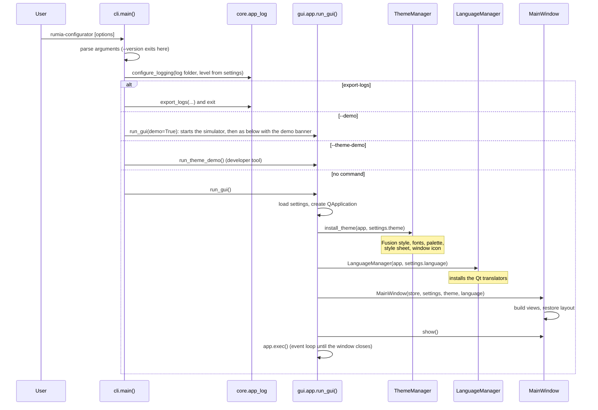

# Architecture

RumiaConfigurator is a desktop application written in Python 3.12 with a
PySide6 (Qt 6) user interface. It configures Rumia CANopen products and shows
the data of any CANopen node on the network.

## Layers

```
User interface   src/rumia_configurator/gui/       PySide6 + pyqtgraph, presentation only
Services         src/rumia_configurator/core/      pure Python, no Qt
Profiles         src/rumia_configurator/profiles/  product profiles and EDS files
CANopen          canopen library                   network, nodes, OD, SDO, PDO, NMT, LSS
Transport        python-can library                can.Bus + can.Notifier
Command line     src/rumia_configurator/cli.py     entry point, also starts the GUI
```

What exists today (version 0.6 in development):

- `core/` holds the user folders, the settings, the application log, the
  connection service that opens the CAN bus ([Connection](connection.md)) and
  the simulator of CANopen nodes used by the tests and by demo mode
  ([Simulator and demo mode](simulator.md)).
- `gui/` holds the main window with placeholder content, the brand theme, the
  translations and a theme demo window.
- `profiles/` holds the provisional EDS files of the Smart IMU and of the
  INCLI Sense, the tolerant EDS loader, the catalog of Rumia products with
  the recognition rules and the profile of each node
  ([EDS and products](eds-and-products.md)); the YAML product profiles come
  later.
- The application connects to one adapter at a time and gets a
  `canopen.Network`. Every frame goes into a ring buffer that the interface
  reads at 30 Hz ([Data flow](data-flow.md)). The network panel lists the
  nodes found by scan, boot-up and heartbeat, with their state and a
  heartbeat alarm ([Network](network.md)); NMT commands are the next step.

## Rules that are never broken

These rules keep the code testable and the application reliable. Every change
must respect them.

1. **`core/` and `profiles/` never import PySide6.** Services must run and be
   tested without a display. When a service needs to tell the interface
   something, it uses a callback; a small adapter in `gui/` turns the callback
   into a Qt signal.
2. **The GUI thread never touches the CAN bus.** Bus operations run in worker
   threads and report back with signals; live data goes through a buffer that a
   30 Hz timer reads. A blocked bus must never freeze the window.
3. **No silent fallback.** If something fails (a connection, a font, a
   translation, a settings file) the user or the log is told what happened.
   The virtual CAN bus is used only when the user chooses demo mode.
4. **Every SDO write reads the answer**, and SDO abort codes are decoded and
   shown with their meaning.
5. **Destructive operations ask for confirmation**: saving to non-volatile
   memory, restoring defaults, NMT reset, changing Node-ID or bitrate, commands
   sent to the whole network.
6. **No user-visible text without `tr()`.** Error messages have three parts:
   what happened, why, what to do. See [Translations](translations.md).
7. **Colors, fonts and sizes come only from the theme tokens.** No color is
   written inside a widget. See [Theme](theme.md); a test enforces it.
8. **The application makes no network connections.** It must work offline.
9. **An incomplete EDS file is loaded anyway**, with warnings; it never blocks
   the application.

Rule 2 is applied by the connection: the bus is opened and closed in worker
threads ([Connection](connection.md#the-gui-side)), and received frames reach
the interface through a buffer read at 30 Hz
([Data flow](data-flow.md#why-the-gui-thread-never-touches-the-bus)). Rules 4 and 9 concern
features that are still to be written; they are listed here because the code
that exists already prepares for them. Rule 5 is applied by
`gui/dialogs.py` and used first by the NMT commands
([Network](network.md#why-some-commands-ask-first)).

## From the command line to the window

The package installs one command, `rumia-configurator`, defined in
`pyproject.toml` as `rumia_configurator.cli:main`. `python -m rumia_configurator`
does the same through `src/rumia_configurator/__main__.py`.



Points worth knowing:

- `cli.py` imports nothing from Qt at module level. Qt is imported only when a
  GUI command runs, so `--version` and `export-logs` start instantly and work
  without a display.
- Logging is configured before anything else, so problems during start-up end
  up in the log file.
- The settings are read twice at start-up: once by the CLI for the log level,
  once by `run_gui()` to build the window. Both reads are cheap.
- When the window closes, `MainWindow.closeEvent()` saves the window geometry
  and the panel width. Every other choice (language, theme, mode) is saved at
  the moment the user makes it.

## Folder layout

```
src/rumia_configurator/
  __init__.py          __version__ (the single source of the version number)
  __main__.py          python -m rumia_configurator
  cli.py               command line: options, logging set-up, starts the GUI
  core/                services without Qt
    paths.py           per-user folders
    settings.py        settings dataclasses, JSON load and save
    app_log.py         rotating log file and ZIP export
    connection/        adapters, open/close the bus, explained errors (FR-CON)
    traffic/           frame ring buffer, traffic statistics (NFR-PER-01)
    network/           nodes: scan, heartbeat, identity (FR-NET)
    simulator/         simulated Smart IMU and INCLI Sense (tests, --demo)
  profiles/
    eds.py             tolerant EDS/DCF import and warnings (FR-SDO-12)
    catalog.py         Rumia products and recognition rules (FR-NET-03)
    association.py     profile of each node for the session (FR-NET-08)
    data/smart_imu/    provisional Smart IMU EDS file
    data/incli_sense/  provisional INCLI Sense EDS file (CiA 410)
  gui/
    app.py             run_gui(): QApplication, theme, language, main window
    connection.py      ConnectionController: bus in worker threads, error messages
    live.py            LiveData: 30 Hz timer from the frame buffer to the views
    network.py         NetworkController: scan worker, heartbeat alarm timer
    main_window.py     MainWindow: layout, user choices, saved layout
    i18n.py            LanguageManager: Qt translators
    theme_demo.py      gallery of the brand components (--theme-demo)
    views/             top bar, network panel, work area, status bar
    widgets/brand.py   reusable brand components
    theme/             tokens, style sheet, fonts, icons, ThemeManager
    translations/      .ts sources and compiled .qm catalogs
    assets/            window icon and top bar logos (generated)
tests/                 automated tests (pytest, pytest-qt)
scripts/i18n.py        update, compile and check the translations
packaging/             icon sources and make_icons.py
docs/development/      this guide
legacy/                the previous prototype, for reference only
```

`legacy/` is never imported by the new code; a test checks it.

## Dependencies

All runtime dependencies are open source with licenses that allow distributing
executables (MIT, BSD, Apache, LGPL). PyQt is not used because it is GPL.

| Package | Used for |
| --- | --- |
| PySide6 | user interface (Qt 6, LGPL) |
| pyqtgraph | live plots (later) |
| canopen, python-can | CANopen stack and CAN transport |
| pyserial | serial port listing (adapter detection) |
| numpy, scipy | data buffers and filters (later) |
| pyyaml, pydantic | product profiles (later) |
| platformdirs | per-user folders |

Development tools: pytest and pytest-qt, ruff, mypy, PyInstaller, pip-licenses,
Pillow (icon generation) and pathspec. They are listed in the `dev` dependency
group of `pyproject.toml` and are not shipped with the application.
