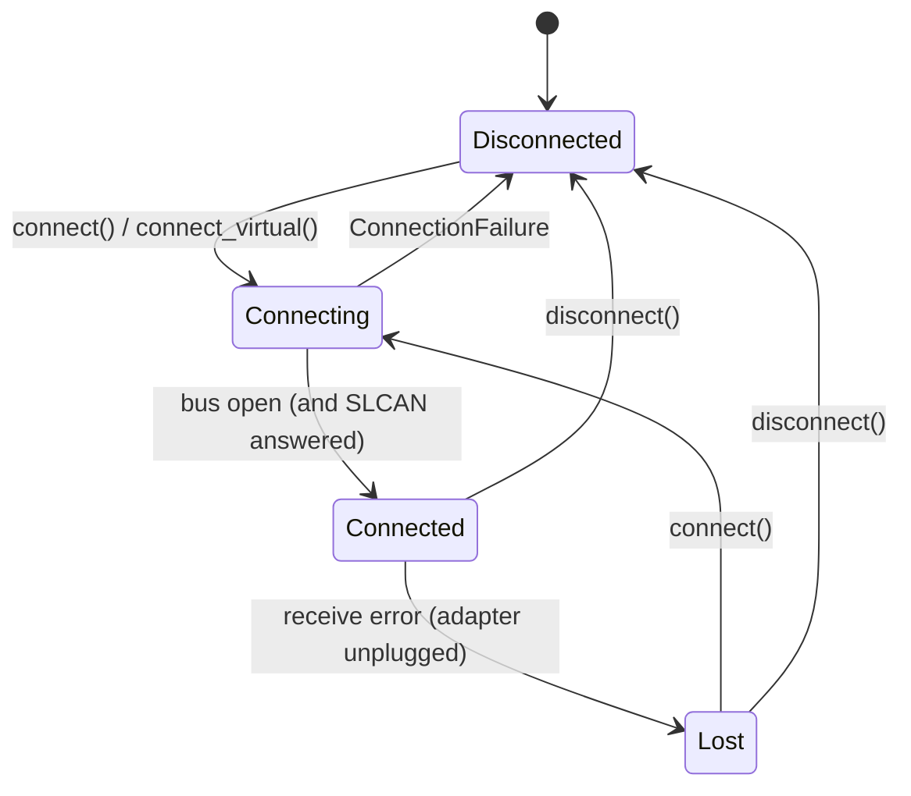

# Connection

The connection service opens and closes the CAN bus, one adapter at a time. It
lists the adapters it can see, tells the user why an adapter cannot be opened,
and notices when an adapter is unplugged. It never falls back to another bus:
the virtual bus is opened only by demo mode.

Source files:

- `src/rumia_configurator/core/connection/adapters.py`: supported backends,
  adapter detection, Rumia USB identifiers
- `src/rumia_configurator/core/connection/errors.py`: `ErrorKind`,
  `ConnectionFailure` and the classification of python-can exceptions
- `src/rumia_configurator/core/connection/service.py`: `ConnectionService`,
  states and controller health
- `src/rumia_configurator/gui/connection.py`: `ConnectionController` (worker
  threads and Qt signals) and the error messages
- `src/rumia_configurator/gui/views/adapter_dialog.py`: the *Other adapter…*
  dialog

The `core` modules do not import Qt; `rumia-configurator adapters` uses them
from the command line.

## States



| State | Top bar | Status bar LED |
| --- | --- | --- |
| `DISCONNECTED` | *Connect*, adapter and bitrate can be changed | grey, "Not connected" |
| `CONNECTING` | *Connecting…*, everything locked | yellow, "Connecting…" |
| `CONNECTED` | *Disconnect*, adapter and bitrate locked | teal, "Connected" |
| `LOST` | *Connect* (to reconnect) | red, "Adapter lost" |

Every state is also written out: the color is never the only signal.

## The service: `ConnectionService`

```python
from rumia_configurator.core.connection import ConnectionConfig, ConnectionService

service = ConnectionService()
service.add_listener(lambda state, failure: print(state, failure))
service.connect(ConnectionConfig("slcan", "COM5", 500_000))  # blocking
network = service.network  # canopen.Network on the open bus
service.disconnect()
```

| Member | What it does |
| --- | --- |
| `connect(config)` | Opens `config.backend` on `config.channel`. Blocking: an SLCAN port alone takes about two seconds, so the GUI calls it from a worker. Raises `ConnectionFailure`. |
| `connect_virtual(channel, bitrate)` | Opens the python-can virtual bus. The only way to open `virtual`: demo mode and tests call it explicitly; `connect()` refuses `virtual`. |
| `disconnect()` | Closes the bus. Does nothing when nothing is open. |
| `state`, `config`, `is_virtual` | Where the connection is and what was opened. |
| `network` | The `canopen.Network` on the open bus (`None` unless `CONNECTED`). Scan, SDO and PDO use it. |
| `add_listener(callback)` | `callback(state, failure)` at every change. It may run on **any thread**: the GUI adapter turns it into a Qt signal. |
| `controller_status()` | `ControllerStatus(state, tx_errors, rx_errors, error_frames)` (FR-CON-08). |
| `traffic` | the `FrameBuffer` of the current connection, a new one at every connection ([Data flow](data-flow.md#the-frame-buffer)). |
| `traffic_stats()` | frames/s and estimated bus load of the last second; load `None` for SocketCAN, whose bitrate is unknown. |

`connect()` does, in order:

1. refuses a second bus (`ALREADY_CONNECTED`), an unknown backend, a backend
   that does not exist on this operating system and an empty channel, before
   opening anything;
2. for SLCAN, checks the port with `probe_slcan()` before python-can opens it:
   any serial port opens, so an answer is needed to be sure that an SLCAN
   adapter is there. The probe closes the CAN channel (`C`), sends the
   version command `V` and accepts **any** answer except silence and a bare
   echo (`NOT_AN_ADAPTER`). The format is not checked: the CANable firmware
   of the Rumia interface answers with its git hash (`b158aa7-dirty`), which
   python-can's `get_version()` would reject, since it expects `Vhhss`. The
   probe is also the first to open the port, so a busy or missing port is
   reported from here;
3. creates the bus with `can.Bus(interface=..., channel=..., bitrate=...)`
   (SocketCAN gets no bitrate: it is set in the operating system). python-can
   waits 2 s after opening an SLCAN port, so a connection takes about 2 s;
4. builds a `RecordingNetwork` (a `canopen.Network` that also records the
   frames it sends) on the bus, with a 0.1 s notifier cycle, and adds two
   listeners to its notifier: `TrafficListener`, which fills a new
   `FrameBuffer`, and the watcher of error frames and lost adapters.

If any step fails, everything opened so far is closed and the caller gets a
`ConnectionFailure`; the listeners get `DISCONNECTED` with the same failure.

### Adapter lost

When the adapter is unplugged, `bus.recv()` raises in the python-can receive
thread. The watcher's `on_error()` sets the state to `LOST` with a
`DEVICE_LOST` failure, and closes the bus from a separate thread (the
receive thread cannot wait for itself). Nothing crashes and no thread keeps
spinning on a dead port (NFR-REL-01). Automatic reconnection (FR-CON-07) is
not implemented yet.

### Controller health (FR-CON-08)

- `state` comes from `bus.state` when the backend implements it (PCAN,
  Kvaser and others). `BusABC.state` says "active" for every backend that
  does not, so the service ignores it in that case.
- Otherwise it comes from the error frames, in the SocketCAN layout used by
  python-can: bus-off flag, controller problem flags in byte 1, TX/RX error
  counters in bytes 6 and 7.
- `None` means "the adapter does not tell": SLCAN adapters report neither
  state nor counters, and the status bar shows "controller n/a". The number of
  error frames is always counted.

## Adapters (FR-CON-01, FR-CON-02)

`list_adapters()` returns `AdapterInfo` objects, Rumia first:

| Order | `kind` | Found from |
| --- | --- | --- |
| 1 | `rumia` | serial port with USB VID:PID 17D0:118E (Rumia CAN Interface) |
| 2 | `canable` | serial port with 16D0:117E (CANable, original SLCAN firmware) |
| 3 | `socketcan` | Linux: `/sys/class/net/<name>/type` is 280 |
| 4 | `serial` | any other serial port: maybe an SLCAN adapter |

The identifiers are in `KNOWN_USB_IDS`. PEAK, Kvaser, IXXAT and candleLight
adapters are not probed, because that would load their drivers at every
refresh: the user picks them in *Other adapter…* with backend and channel.
`BACKENDS` lists each backend with its label, a channel example, the systems
where it works and whether it needs a bitrate.

The candleLight backend (`gs_usb`) needs pyusb and libusb, which are not
dependencies of the application: choosing it gives a "driver missing" message
that says so.

## Errors (FR-CON-05)

python-can backends report a failed open in very different ways: a
`CanInitializationError` with the OS error as text, a plain `OSError`, a
`CanInterfaceNotImplementedError`, even a `NameError` when the Kvaser library
is missing. `classify_open_error()` looks at the exception, its causes, the
`errno` values and known pieces of text, and returns one `ErrorKind`. The
original text stays in `ConnectionFailure.detail` for the log.

`failure_message()` in `gui/connection.py` turns the kind into a translated
message in three parts:

| `ErrorKind` | What happened | Why | What to do |
| --- | --- | --- | --- |
| `PORT_NOT_FOUND` | Could not connect to COM5. | The port does not exist: the adapter is unplugged or has another name. | Plug it in, *Refresh list*, select it again. |
| `PORT_BUSY` | " | Another program is using the port (on Windows "access denied" on a COM port means this). | Close the other program and retry. |
| `PERMISSION_DENIED` | " | Your user may not use serial ports (Linux, macOS). | The administrator runs `sudo usermod -aG dialout $USER` once (`uucp` on Arch and macOS); log out and in. |
| `DRIVER_MISSING` | " | The driver or library of the adapter is not installed. | Install the vendor driver (PEAK PCAN-Basic, Kvaser CANlib, IXXAT VCI); gs_usb is not included. |
| `INTERFACE_DOWN` | " | The SocketCAN interface is down. | The administrator runs `sudo ip link set can0 up type can bitrate 500000`. |
| `NOT_AN_ADAPTER` | " | The port opened but nothing answered like SLCAN. | Choose the port marked RUMIA; unplug and plug it in again. |
| `NOT_ON_THIS_SYSTEM` | " | That adapter type does not exist on this system (SocketCAN outside Linux). | Choose another type. |
| `INVALID_SETTINGS` | " | Empty channel, unknown backend, bitrate refused. | Check the settings in *Other adapter…*. |
| `ALREADY_CONNECTED` | " | One bus at a time. | Disconnect first. |
| `DEVICE_LOST` | The connection to COM5 was lost. | The adapter stopped answering. | Plug it in again and press *Connect*. |
| `UNKNOWN` | Could not connect to COM5. | The library text. | Retry; export the logs and send them to support. |

### Permissions on Linux (NFR-SEC-02)

The application never runs commands with administrator rights and never calls
`sudo`. On Linux, serial ports belong to the `dialout` group (`uucp` on Arch);
a user outside the group gets `PERMISSION_DENIED`, and the message tells which
command the administrator runs once. SocketCAN interfaces are brought up by
the administrator with `ip link`, with the bitrate of the network; the
application then opens them without a bitrate.

## The GUI side

`ConnectionController` (`gui/connection.py`) owns a `ConnectionService` and its
own `QThreadPool`:

| Method / signal | What it does |
| --- | --- |
| `refresh_adapters()` → `adapters_listed(list)` | lists the adapters in a worker |
| `connect_bus(config)`, `connect_virtual(channel, bitrate)`, `disconnect_bus()` | run the service in a worker |
| `state_changed(state, failure)` | every change of state, delivered in the GUI thread |
| `status_updated(ControllerStatus)` | every second while connected |
| `shutdown()` | at exit: waits for the workers, closes the bus, then emits nothing more |

`MainWindow` connects the top bar to the controller:

- the adapter menu lists the adapters found, then *Refresh list* and *Other
  adapter…*; when nothing usable is chosen, the first adapter (Rumia, if
  present) is selected for the user;
- the bitrate menu offers the CiA 301 values (FR-CON-03);
- *Connect* opens the chosen adapter. After a successful connection backend,
  channel and bitrate are saved in the settings and proposed at the next
  start; the application never connects by itself;
- a failure opens an error dialog in three parts and is written as last event
  in the status bar;
- in demo mode `run_gui()` calls `MainWindow.start_demo_connection()` after
  starting the simulator: the adapter reads "Virtual bus (demo)" and cannot
  be changed, and the virtual bus is never saved in the settings.

## Add a backend

python-can supports more interfaces than the application offers. To add one
(for example `vector`):

1. In `src/rumia_configurator/core/connection/adapters.py`, add a `Backend` to
   `BACKENDS` with the python-can interface name, a label, a channel example,
   the systems where it works and `needs_bitrate`.
2. If its open errors are not classified well, add the text or exception to
   `classify_open_error()` in `src/rumia_configurator/core/connection/errors.py`,
   and a case to `tests/test_connection_errors.py` with the **real**
   exception (try it on a machine without the driver).
3. If it needs a vendor driver, add a remedy in `_driver_remedy()` in
   `src/rumia_configurator/gui/connection.py` and translate it
   ([Add a translated text](recipes.md#add-a-translated-text)).
4. Update the tables of this page. The backend appears in *Other adapter…* on
   the systems you listed.

Every dependency must have a license compatible with distributing
executables (see [Architecture](architecture.md#dependencies)).

## Try the connection without hardware

- **Demo mode**: `uv run rumia-configurator --demo` connects to the simulated
  Smart IMU and INCLI Sense ([Simulator and demo mode](simulator.md#demo-mode)).
- **Tests on the virtual bus**: the `simulator` fixture plus
  `ConnectionService().connect_virtual(sim_channel)`; see
  `test_virtual_bus_finds_the_simulated_nodes` in
  `tests/test_connection_service.py`.
- **Fake buses for failures**: `ConnectionService(bus_factory, system, slcan_probe)`
  takes replacements for `can.Bus`, `platform.system()` and the serial port
  check (a function that returns what the port answered). The `FakeBus` in
  `tests/test_connection_service.py` opens, delivers
  error frames and can be "unplugged".
- **Error dialogs**: `tests/test_connection_gui.py` replaces
  `QMessageBox.critical` and checks the three parts.
- **Adapters on this computer**: `uv run rumia-configurator adapters`.

With the real adapter, check by hand: Rumia adapter recognized (17D0:118E),
connection at the network bitrate, port held by another program, and
unplugging during a connection ("Adapter lost", no crash).
