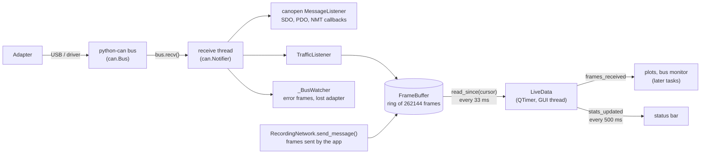

# Data flow

This page follows a CAN frame from the adapter to the screen: who receives
it, where it is kept, how the interface reads it, and how frames per second
and bus load are computed. Every live feature (plots, bus monitor,
recording) reads frames this way.

Source files:

- `src/rumia_configurator/core/traffic/buffer.py`: `FrameBuffer`, the ring
  buffer of frames
- `src/rumia_configurator/core/traffic/recorder.py`: `TrafficListener` and
  `RecordingNetwork`, which fill the buffer
- `src/rumia_configurator/core/traffic/stats.py`: frames per second and
  estimated bus load
- `src/rumia_configurator/gui/live.py`: `LiveData`, the 30 Hz timer of the
  interface

## The path of a frame



1. **One receive thread.** `ConnectionService` opens one `can.Bus` and one
   `canopen.Network`, whose `can.Notifier` runs a single thread that calls
   `bus.recv()` and hands every message to its listeners. There is no other
   reading thread: python-can delivers each frame once, to everyone.
2. **Into the buffer.** `TrafficListener.on_message_received()` appends the
   message to the `FrameBuffer` of the connection. It runs in the receive
   thread and does only that: a few microseconds per frame.
3. **Frames sent by the application.** `ConnectionService` builds the network
   as a `RecordingNetwork`, whose `send_message()` sends the frame and then
   stores it with the TX flag. Sent frames take bus time too, and the bus
   monitor shows them. Periodic sending by python-can tasks
   (`send_periodic`, used for heartbeat or SYNC production) is not recorded;
   the application does not use it yet.
4. **To the interface.** `LiveData` owns one `QTimer` at 30 Hz in the GUI
   thread. At every tick it takes what is new since its cursor and emits
   `frames_received(frames)`; every 15 ticks (500 ms) it emits
   `stats_updated(TrafficStats)` for the status bar.

### Why the GUI thread never touches the bus

Reading the bus blocks: `bus.recv()` waits for the next frame, a serial port
can stall, a driver can take seconds to report an error. If the GUI thread
did it, the window would freeze. The receive thread absorbs every wait; the
GUI thread only copies from memory, under a lock held for microseconds. At
5000 frames/s a tick copies about 170 frames, which takes well under 5 ms
of the 33 ms between ticks (a test checks it, NFR-PER-03).

For the same reason SDO requests, which wait for an answer, run in worker
threads, and the connection is opened and closed in a worker
([Connection](connection.md#the-gui-side)).

## The frame buffer

`FrameBuffer` is a preallocated numpy array of `FRAME_DTYPE` records,
`DEFAULT_CAPACITY` = 2^18 = 262144 frames, about 52 s at 5000 frames/s and
12 MB of memory. A new buffer is created at every connection
(`ConnectionService.traffic`).

| Field | Type | Content |
| --- | --- | --- |
| `rx_time` | float64 | `time.monotonic()` when the frame was stored: used for statistics |
| `timestamp` | float64 | timestamp given by python-can, from the adapter where it has one (FR-DAT-03) |
| `can_id` | uint32 | 11 or 29 bit identifier |
| `dlc` | uint8 | data length |
| `flags` | uint8 | `FLAG_EXTENDED`, `FLAG_RTR`, `FLAG_ERROR`, `FLAG_TX` |
| `data` | 8 × uint8 | data bytes, zero-padded |

The buffer also counts `written` (every frame since the connection),
`error_frames` and `tx_frames`.

### Readers and cursors

Any number of readers take frames, each with its own **cursor**, the value of
`written` at its last read:

```python
result = buffer.read_since(cursor)  # ReadResult(frames, cursor, lost)
cursor = result.cursor
```

- `frames` is a **copy**, oldest first: the reader can keep it while the
  buffer moves on.
- `lost` is the number of frames that were overwritten before the reader
  took them, because it fell more than one buffer behind. Frames are never
  lost silently: `LiveData` adds them up and the status bar shows "lost N"
  in red.
- A reader that wants only new frames starts at `buffer.written`; one that
  wants everything still in memory starts at 0.

`received_after(t)` returns the frames stored after a given `rx_time`; it
finds the start with a binary search, so its cost does not depend on how
long the session has been running. `latest(n)` returns the last `n` frames.

## Frames per second and bus load

`compute_stats()` (and `ConnectionService.traffic_stats()`) looks at the
frames of the last second, the window (now − 1 s, now]:

- **frames/s**: data and remote frames received or sent in the window.
  Error frames are counted apart (`error_frames`).
- **bus load %**: estimated bits of those frames divided by the bitrate.

The exact length of a frame depends on bit stuffing (a bit added after five
equal bits), which depends on its content. The load is therefore an
**estimate**, close to what common CAN tools show:

| Frame | Nominal bits |
| --- | --- |
| standard identifier (11 bit) | 47 + 8 × DLC |
| extended identifier (29 bit) | 67 + 8 × DLC |
| remote frame | as above with DLC counted as 0 |

The nominal length counts start of frame, arbitration, control, data, CRC,
acknowledge, end of frame and the 3-bit interframe space. It is multiplied by
`STUFFING_FACTOR` = 1.1 for the average stuffing; the real stuffing ranges
from 0 to about 20% more. A full CAN 2.0A frame with 8 data bytes is thus
111 × 1.1 ≈ 122 bits.

The bitrate comes from the connection. With SocketCAN it is set in the
operating system and the application does not know it: the load is `None`
and the status bar shows "load -".

## Add a consumer of live frames

A view that shows live data (a plot, the bus monitor) connects to
`LiveData.frames_received` and filters what it needs, with numpy, without
loops in Python:

```python
def on_frames(self, frames: np.ndarray) -> None:
    mine = frames[frames["can_id"] == 0x180 + node_id]
    values = mine["data"][:, 0:2].copy().view("<i2")[:, 0]  # first INT16
    self.plot.append(mine["timestamp"], values)


window.live.frames_received.connect(view.on_frames)
```

Rules:

- Do the work in a vectorised way and keep it short: the slot runs in the GUI
  thread, 30 times a second.
- Never keep a reference into the buffer: `frames` is already a copy.
- A consumer that must not miss frames even when the interface is busy (the
  recording, T4.3) reads the buffer with **its own cursor** in its own
  thread, and handles `lost`.

## Tests

- `tests/test_frame_buffer.py`: fields, cursors, wrap-around, `lost`,
  `received_after()`.
- `tests/test_traffic_stats.py`: bits per frame, load of a known traffic,
  window, error and sent frames, no bitrate.
- `tests/test_traffic_load.py`: the acceptance test of T1.3. A generator sends
  **5000 frames/s for 30 s** on the virtual bus; the application side,
  with a buffer of only about 3 s, must receive all 150,000 frames, in order,
  with `lost` = 0, and measure 5000 frames/s ± 10% in a one-second sample halfway (a busy
  runner makes the generator lag for a moment). It runs in every
  `uv run pytest` and takes 30 s.
- `tests/test_live_data.py`: frames reach the GUI within 100 ms, a tick with
  170 frames takes less than 5 ms, sent frames are recorded, the status bar
  shows frames/s and load in both languages, lost frames are shown.

Note for tests: `can.Message` has an **extended** identifier by default
(`is_extended_id=True`). Test frames that stand for 11-bit CANopen frames
must set `is_extended_id=False`, or the load is computed for 29-bit frames.
