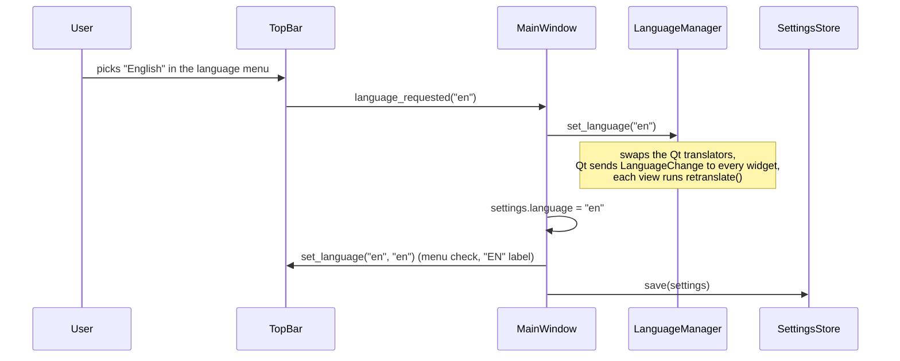

# User interface

The interface is written with PySide6 (the official Qt 6 binding for Python),
entirely in Python code. It lives in `src/rumia_configurator/gui/`. This page
covers the main window and its views; the look is described in
[Theme](theme.md) and the texts in [Translations](translations.md).

Source files:

- `src/rumia_configurator/gui/app.py`: start-up of the interface
- `src/rumia_configurator/gui/main_window.py`: the main window
- `src/rumia_configurator/gui/connection.py`: the connection controller and its
  error messages ([Connection](connection.md#the-gui-side))
- `src/rumia_configurator/gui/views/adapter_dialog.py`: the *Other adapter…*
  dialog
- `src/rumia_configurator/gui/views/nmt_menu.py`: the NMT menu of a node
- `src/rumia_configurator/gui/views/profile_dialog.py`: *Associate profile…*
  and the list of EDS warnings ([EDS and products](eds-and-products.md))
- `src/rumia_configurator/gui/dialogs.py`: `confirm_action()`, the confirmation
  of destructive operations ([Recipes](recipes.md#add-an-operation-that-asks-for-confirmation))
- `src/rumia_configurator/gui/network.py`: `NetworkController`, scan and
  heartbeat alarm for the network panel ([Network](network.md))
- `src/rumia_configurator/gui/live.py`: `LiveData`, the 30 Hz timer that brings
  received frames and traffic statistics to the views
  ([Data flow](data-flow.md))
- `src/rumia_configurator/gui/views/top_bar.py`, `src/rumia_configurator/gui/views/node_panel.py`,
  `src/rumia_configurator/gui/views/workspace.py`, `src/rumia_configurator/gui/views/status_bar.py`:
  the four views
- `src/rumia_configurator/gui/views/demo_banner.py`: the demo mode banner
- `src/rumia_configurator/gui/theme_demo.py`: the theme demo window (developer tool)

## Start-up: `gui/app.py`

`run_gui()` is called by the command line when no other command is given (see
[Architecture](architecture.md#from-the-command-line-to-the-window)). In order:

1. Loads the settings with `SettingsStore`.
2. Creates the `QApplication` and sets the application name, organisation and
   domain (`rumia.it`).
3. `install_theme(app, settings.theme)`: style, fonts, colors, window icon.
4. `LanguageManager(app, settings.language)`: installs the translations.
5. In demo mode (`--demo`), starts the simulated nodes with `_start_demo()`;
   if they cannot start, shows the error and exits with code 1
   ([Simulator and demo mode](simulator.md#demo-mode)).
6. Creates `MainWindow`, passing the simulated nodes in demo mode. If the
   settings had problems, the status bar says so.
7. Shows the window and runs the Qt event loop until the window closes.

Qt 6 handles high-density screens by itself, including fractional scaling such
as 125% or 150% (UI-LAY-06): no code is needed for it.

## The main window: `gui/main_window.py`

```
┌──────────────────────────────────────────────────────────────────────┐
│ TopBar          logo · adapter · bitrate · Connect · state ·         │
│                 Setup wizard · Base|Expert · IT/EN · menu            │
├──────────────────┬───────────────────────────────────────────────────┤
│ NodePanel        │ Workspace                                         │
│ (network)        │   title of the selected node                      │
│                  │   tabs: Overview · Parameters · PDO · Plots ·     │
│ Scan             │         Bus monitor · Log                         │
│ node list        │   page of the active tab                          │
│ NMT commands     │                                                   │
├──────────────────┴───────────────────────────────────────────────────┤
│ StatusBar        bus state · adapter · bitrate · frames/s · load ·   │
│                  errors · last event                                 │
└──────────────────────────────────────────────────────────────────────┘
```

`MainWindow` (a `QMainWindow`) builds the four views and puts them in a
vertical layout. The network panel and the work area sit in a `QSplitter`, so
the user can drag the border between them (UI-LAY-05).

`MainWindow` is the only object that **applies and saves** the user's choices.
The views never change settings themselves: they emit a signal, and the window
does the work. This keeps each view simple and puts every side effect (saving,
switching theme or language) in one place.



Theme and mode follow the same path with `theme_requested` and
`mode_requested`.

### What `MainWindow` offers

| Method | What it does |
| --- | --- |
| `set_ui_mode(mode)` | `"base"` or `"expert"`: updates the top bar and the tabs, saves |
| `set_language(setting)` | `""`, `"it"` or `"en"`: switches language without restart, saves |
| `set_theme_mode(mode)` | `"system"`, `"light"` or `"dark"`: switches theme without restart, saves |
| `export_logs()` | asks for a file name and writes the log ZIP |
| `report_settings_reset()` | tells the user that some settings were reset |
| `retranslate()` | sets the window title in the current language |

### Saving the layout

- **Window position and size**: Qt's `saveGeometry()` returns binary data; it
  is stored as base64 text in `settings.window_geometry`. At start-up
  `restoreGeometry()` puts the window back. If the data is missing or invalid
  the window opens at 1366×768 and a warning goes to the log.
- **Network panel width**: stored in `settings.node_panel_width` (272 px by
  default, as in the mockup).
- Both are written when the window closes (`closeEvent`). If saving fails, the
  status bar shows the reason.

The window must fit a 1366×768 screen without horizontal scrolling in both
languages (UI-LAY-06). Its minimum width today is 1259 px in Italian and 1160
px in English, set by the top bar: about 100 px are left in Italian, not
enough for another button with text. A test checks it; when you add something
to the top bar, run `uv run pytest tests/test_main_window.py` (see
[Recipes](recipes.md#add-a-button-to-a-view)).

### Menu actions

The menu button at the right end of the top bar has:

- **Theme** → System / Light / Dark.
- **Export logs…**: a save dialog, then `core.app_log.export_logs()`. If
  writing fails, an error dialog explains what happened, why and what to do.
  On success the status bar shows where the file went.
- **Quit**: closes the window (layout is saved as usual).

## Views: `gui/views/`

Every view is a Qt widget built in Python. They share the same structure:

- `__init__` creates the child widgets and the layout, **without texts**;
- `retranslate()` sets every visible text with `self.tr(...)`; it is called at
  the end of `__init__` and again whenever the language changes;
- `changeEvent()` calls `retranslate()` when Qt sends `LanguageChange`.

This pattern is explained in [Translations](translations.md#the-retranslate-pattern).

### Top bar: `views/top_bar.py`

`TopBar` (UI-LAY-01) shows, from left to right: the Rumia logo, "Configurator",
the adapter and bitrate selectors, *Connect*, the connection state, *Setup
wizard*, the Base/Expert switch, the language button and the menu.

Signals it emits (the main window connects them):

| Signal | Argument | Emitted when |
| --- | --- | --- |
| `mode_requested` | `"base"` / `"expert"` | the user clicks Base or Expert |
| `language_requested` | `""` / `"it"` / `"en"` | the user picks a language |
| `theme_requested` | `"system"` / `"light"` / `"dark"` | the user picks a theme |
| `export_logs_requested` | | *Export logs…* |
| `quit_requested` | | *Quit* |
| `adapter_selected` | backend, channel | the user picks an adapter in the menu |
| `refresh_adapters_requested` | | *Refresh list* |
| `other_adapter_requested` | | *Other adapter…* |
| `bitrate_selected` | bit/s | the user picks a bitrate |
| `connect_clicked` | | *Connect* or *Disconnect* |

Methods to show the current state: `set_mode()`, `set_language(setting,
language)` (checks the menu item and writes `IT` or `EN` on the button),
`set_theme_mode()`, `set_adapters()`, `set_selection()`, `set_bitrate()`,
`set_connection_state()` and `set_demo()`. `adapter_text()` gives the short
name of an adapter ("Rumia USB-CAN · COM5"); names longer than 170 px are
elided in the middle and shown whole in the tooltip, so the bar still fits at
1366 px.

The logo has two versions, `gui/assets/logo_light.png` and `logo_dark.png`
(white wordmark). The top bar listens to `ThemeManager.changed` and swaps the
picture, scaled smoothly for the screen density. `format_bitrate()` turns
`1000000` into `1000 kbit/s`; the status bar uses it too.

While connected, adapter and bitrate are locked; in demo mode the adapter
reads "Virtual bus (demo)" and stays locked. *Setup wizard* stays disabled
until the wizard exists. The states are described in
[Connection](connection.md#states).

### Network panel: `views/node_panel.py`

`NodePanel` (UI-LAY-02) is the surface-colored column on the left: a title
with the number of nodes ("Network · 2 nodes", with a proper plural), the
*Scan* button (enabled while connected, "Scanning…" during a scan), the list
of nodes, one `NodeRow` each, or an empty state that tells the user what to
do, and at the bottom the commands to the whole network (*Start*, *Pre-op*,
*Reset*, disabled until the NMT commands exist). Its minimum width is 220 px.

Each row shows the Node-ID, the name, the RUMIA badge for Rumia products,
the NMT state with its LED and the heartbeat period; a missing heartbeat turns
the LED red and says for how long. A node without profile has the link
*Associate profile…*.
Signals: `scan_requested`, `node_selected(node_id)`. Methods: `set_nodes()`,
`set_connected()`, `set_scanning()`, `select()`. The details are in
[Network](network.md#model-and-view).

The header of the work area shows the selected node (`Workspace.set_node()`):
name and Node-ID, then Vendor-ID, Product code, revision and serial number,
the **NMT** button with the menu of the node, and a warning callout
(`show_notice()`) when a command was not confirmed. The panel buttons at the
bottom and a right click on a row send NMT commands too
([Network](network.md#nmt-commands-fr-net-04)).

### Work area: `views/workspace.py`

`Workspace` (UI-LAY-03) has a header (node name and details, today "No node
selected") and a `QTabWidget` with six tabs, identified by keys:

```python
TAB_KEYS = ("overview", "parameters", "pdo", "plots", "monitor", "log")
BASE_TABS = ("overview", "plots")
```

`set_mode("base")` hides every tab not in `BASE_TABS`; `set_mode("expert")`
shows all of them (FR-APP-04). `visible_tabs()` returns the keys of the
visible tabs, which the tests use.

Each tab holds a `PlaceholderPage`: a card with an icon, the tab name and a
sentence that says what will appear there. Real pages will replace them one by
one; to add a tab follow [Recipes](recipes.md#add-a-tab-to-the-work-area).

### Demo banner: `views/demo_banner.py`

Only in demo mode, `DemoBanner` sits between the top bar and the work area: an
`info` callout titled *Demo mode* that names the simulated nodes and says that
no real device is connected. It has no close button, so the user always knows
the data is simulated (FR-CON-06). `MainWindow.demo_banner` is `None` outside
demo mode.

### Status bar: `views/status_bar.py`

`StatusBar` (UI-LAY-04) is the dark bar at the bottom: bus state LED and text,
adapter, bitrate, frames per second, bus load, error count and, on the right,
the last event. All values use the monospaced font so that digits do not move.

`show_event(text)` writes the last event (the text must already be
translated). Until the first event the bar shows "Ready".

`set_connection(state, adapter_text, bitrate)` shows the connection, and
`set_controller(status)` the CAN controller health (FR-CON-08): "error
active", "error passive" or "bus-off", TEC/REC when the adapter reports them,
"controller n/a" when it does not, and the number of error frames. Error
passive and bus-off are written in the `statusbar_error` color, always with
their text.

`set_traffic(stats)` shows frames per second and the estimated bus load,
twice a second, with the decimal separator of the interface language
("load 12.3 %", "carico 12,3 %"; "load -" when the bitrate is unknown). If
frames were lost it adds "lost N" in the `statusbar_error` color. `MainWindow`
starts `LiveData` when the connection opens and stops it when it closes.

## Brand widgets: `gui/widgets/brand.py`

The views are built from a small set of components (buttons, links, cards,
callouts, status LEDs, value tiles, badges, section labels). They are described
in [Theme](theme.md#brand-components), because their look comes entirely from
the style sheet.

## Developer tool: the theme demo

`rumia-configurator --theme-demo` opens `gui/theme_demo.py`, a window that
shows every brand component in the light and dark theme. It is meant for
checking visual changes and is not translated. See
[Theme](theme.md#theme-demo).
