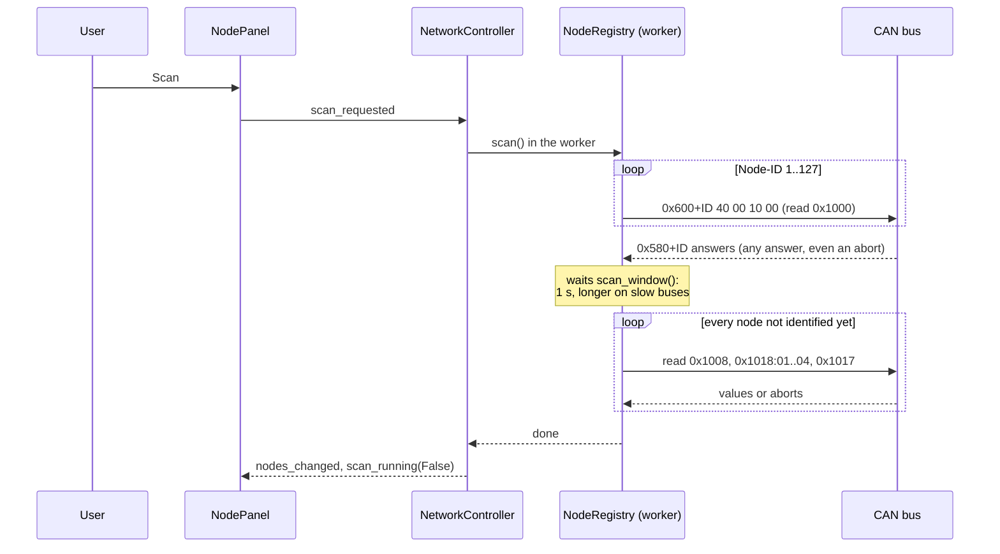
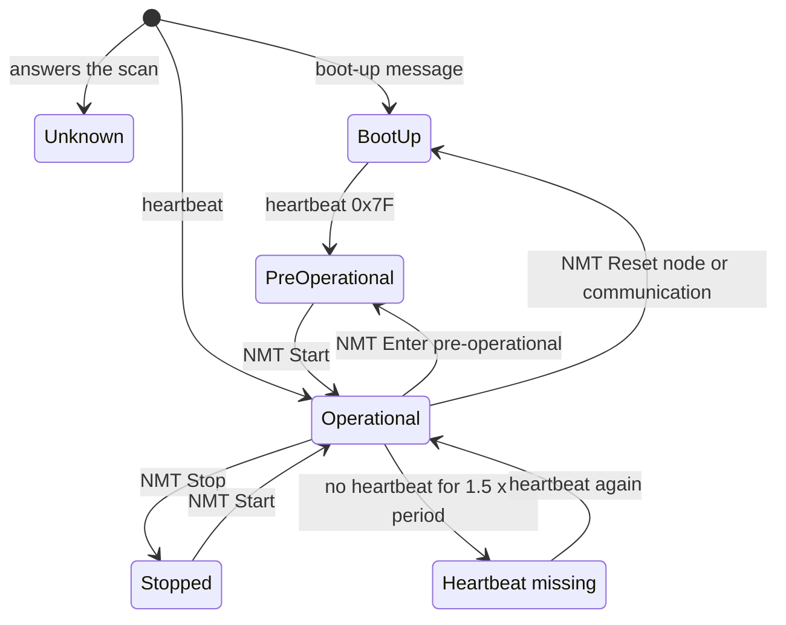

# Network

This page explains how the application finds the nodes on the CANopen
network, reads who they are, follows their NMT state and notices when one
stops sending its heartbeat, and how the NMT commands are sent, confirmed
and checked.

Source files:

- `src/rumia_configurator/core/network/nodes.py`: `NodeInfo`, `NmtState`,
  `SeenBy`
- `src/rumia_configurator/core/network/registry.py`: `NodeRegistry`: scan,
  passive listening, identity, heartbeat alarm, check of NMT commands
- `src/rumia_configurator/core/network/nmt.py`: `NmtCommand`, `send_nmt()`,
  `NmtOutcome`
- `src/rumia_configurator/gui/views/nmt_menu.py`: `NmtMenu`, the NMT menu of a
  node
- `src/rumia_configurator/gui/dialogs.py`: `confirm_action()`, the confirmation
  of destructive operations
- `src/rumia_configurator/gui/network.py`: `NetworkController`, the Qt side
- `src/rumia_configurator/gui/views/node_panel.py`: `NodePanel` and
  `NodeRow`, the network panel on the left

## How a node is found

A node becomes known in three ways (FR-NET-01):

| Way | Frame | When |
| --- | --- | --- |
| **boot-up** | `0x700 + ID`, data `00` | the node has just started or been reset |
| **heartbeat** | `0x700 + ID`, data = NMT state | every period of 0x1017, if the node produces it |
| **scan** | answer on `0x580 + ID` to an SDO request | the user presses *Scan* |

Nodes are **not** found from their PDOs or EMCY messages. `canopen`'s own
`NodeScanner` does that, but a PDO can be moved to any COB-ID, and a TPDO
configured on `0x1AA` would make a "node 42" appear even if node 42 does not
exist.

Passive listening starts as soon as the connection opens: nodes that send a
heartbeat appear by themselves within one period. The scan is a gesture of
the user, never automatic: it sends 127 requests, which on a production
network should be a choice.

### The scan



- Any answer counts, an SDO abort too: a node that has no object 0x1000
  still exists.
- The waiting time is 1 s, or twice the time needed to send 127 requests and
  127 answers at the current bitrate (about 6 s at 10 kbit/s).
- The requests go through `RecordingNetwork.send_message()`, so they appear as
  sent frames in the bus monitor and in the bus load ([Data flow](data-flow.md)).

### Identity

`read_identity(node_id)` reads, one SDO upload each:

| Object | Field of `NodeInfo` |
| --- | --- |
| 0x1008 Manufacturer device name | `name` |
| 0x1018:01..04 Identity | `vendor_id`, `product_code`, `revision`, `serial` |
| 0x1017 Producer heartbeat time | `heartbeat_ms` |

An object that cannot be read (abort, timeout) stays `None`, and the reason is
added to `identity_error` (for example `0x1008:00 abort 0x06020000`). The node
stays in the list in any case: the Smart IMU of today has no 0x1008 and shows
as "Node without name". After the identity is read the node is recognised
and gets the EDS of its product ([EDS and products](eds-and-products.md)).

The identity is read once per node. It is read again after a boot-up message,
because a node that restarted may have new settings.

## States of a node

The NMT state comes from the heartbeat byte (bit 7, the toggle bit of node
guarding, is ignored):

| Byte | `NmtState` | LED | Text |
| --- | --- | --- | --- |
| `0x00` | `BOOTUP` | yellow | Boot-up |
| `0x04` | `STOPPED` | grey | Stopped |
| `0x05` | `OPERATIONAL` | teal | Operational |
| `0x7F` | `PRE_OPERATIONAL` | yellow | Pre-operational |
| none yet | `UNKNOWN` | grey | State unknown (found by the scan, no heartbeat seen) |



The names of the NMT states are the same in Italian and English, as in the
CANopen documentation.

## Heartbeat alarm (FR-NET-05)

`check_heartbeats()` runs four times a second (`NetworkController`, 250 ms).
A node is in alarm when no heartbeat arrived for more than **1.5 times the
expected period**:

1. the expected period is 0x1017 when it was read;
2. if 0x1017 could not be read, the period observed between the last two
   heartbeats;
3. if 0x1017 is 0, the node produces no heartbeat: no alarm, and the row says
   "heartbeat off";
4. if nothing is known (a node found by the scan with 0x1017 unreadable and
   no heartbeat), no alarm.

The time is counted from the last heartbeat, or from when the node was found
if no heartbeat has arrived yet. Each change (alarm on, alarm off) is reported
once: the row turns red with "Heartbeat missing for 3.2 s", and the status bar
shows "Node 29: heartbeat missing", then "Node 29: heartbeat back". The color
is never the only signal.

The 1.5 factor leaves room for the jitter of a busy bus and of the operating
system without hiding a node that really stopped: with the default 1000 ms,
the alarm comes 1.5 s after the last heartbeat, plus at most 250 ms.

## NMT commands (FR-NET-04)

An NMT command is one frame on COB-ID `0x000` with two bytes: the command
specifier and the Node-ID (0 = every node). `send_nmt()` in
`src/rumia_configurator/core/network/nmt.py` sends it through
`RecordingNetwork`, so it appears as a sent frame in the bus monitor.

| Command | Byte | Expected after it | Per node | Whole network |
| --- | --- | --- | --- | --- |
| Start | `0x01` | Operational | no confirmation | **confirmation** |
| Stop | `0x02` | Stopped | no confirmation | not offered |
| Pre-operational | `0x80` | Pre-operational | no confirmation | **confirmation** |
| Reset node | `0x81` | boot-up | **confirmation** | **confirmation** (*Reset* button) |
| Reset communication | `0x82` | boot-up | **confirmation** | not offered |

Where the user finds them:

- the **NMT** button in the header of the selected node (`Workspace.nmt_button`)
  and the **right click** on a row of the panel open the same `NmtMenu`
  (`src/rumia_configurator/gui/views/nmt_menu.py`); the entries that ask for
  confirmation end with "…";
- the *Start*, *Pre-op* and *Reset* buttons at the bottom of the panel send to
  the whole network.

### Why some commands ask first

A command to the whole network reaches **every** node, also the ones the
application does not list (a node without heartbeat that was never scanned,
a device of another vendor). Start makes machines move, Pre-operational stops
the PDOs a PLC may depend on, and a reset makes nodes restart and lose the
settings not stored with 0x1010. For one node, Start, Stop and
Pre-operational are the normal tools of commissioning and do not ask; the
resets do, because they lose settings. The texts of the confirmations say
what will happen, what it causes and what to check first
([Recipes](recipes.md#add-an-operation-that-asks-for-confirmation)).

### Checking the effect (NFR-REL-03)

NMT has no answer. After sending, `NodeRegistry.verify_nmt()` watches the
heartbeats, in the same one-thread worker as the scan:

| Outcome | Meaning |
| --- | --- |
| `CONFIRMED` | a heartbeat with the expected state arrived after the command; for a reset, a boot-up message |
| `NOT_CONFIRMED` | heartbeats arrived, but in another state |
| `NO_HEARTBEAT` | nothing arrived in time |
| `NOT_VERIFIABLE` | the node produces no heartbeat (0x1017 = 0) |

Each node gets 2 times its heartbeat period, at least 1 s and at most 10 s.
For a command to the whole network the nodes in the list are checked. The
result goes to the status bar ("Node 29: Stop confirmed by the heartbeat",
"Whole network: Pre-operational confirmed by 2 of 2 nodes"); if a node did
not confirm, a warning callout under the node header says what happened, why
it can happen and what to do.

The registry uses `time.perf_counter()` as its clock: on Windows
`time.monotonic()` advances in steps of about 16 ms, and a boot-up arriving
right after the command got the same time as the command itself.

## Model and view

```
NodeRegistry (core, no Qt)            NetworkController (gui)          NodePanel (gui)
  callbacks in the receive thread  ->   4 Hz timer: check_heartbeats,  -> NodeRow per node
  scan / read_identity (worker)         snapshot -> nodes_changed         node_selected
  snapshot(): list[NodeInfo]            one-thread pool for SDO           Scan button
```

- **`NodeRegistry`** keeps one record per node under a lock. Heartbeat and SDO
  answers arrive in the python-can receive thread; `scan()` and
  `read_identity()` are blocking. `snapshot()` returns frozen `NodeInfo`
  copies, with `silent_for` computed at that moment. A new registry is
  created at every connection; `close()` unsubscribes everything.
- **`NetworkController`** creates the registry when the connection opens and
  closes it when it ends. Its `QThreadPool` has **one** thread: the scan and
  the identity reads are SDO transactions, and two transactions on the same
  node at the same time would mix their answers. Nodes found by heartbeat get
  their identity read automatically in that same thread.
- **`NodePanel`** shows one `NodeRow` per node, updated in place: Node-ID in
  mono, name (elided, full name in the tooltip), `StatusLed` with the state
  written out, and the heartbeat period. A row is selected with a click,
  Enter or Space; Up and Down move the selection. The selected node is shown
  in the header of the work area by `Workspace.set_node()`.

## Tests

- `tests/test_node_registry.py`: scan and identity, passive discovery, NMT
  state, heartbeat alarm on and off, heartbeat off, node without 0x1008, no
  nodes from PDOs, identity read again after boot-up, scan frames recorded,
  scan window.
- `tests/test_nmt.py`: NMT frames, Start, Stop, Pre-operational and both
  resets confirmed by the heartbeat, whole network, silent node, heartbeat
  off, node that ignores the command, commands recorded as sent.
- `tests/test_nmt_gui.py`: buttons enabled only when connected; a cancelled
  reset sends nothing; confirmed commands are sent and checked; Stop from the
  node menu asks nothing, a reset asks first; warning when a node does not
  confirm; the dialog defaults to Cancel.
- `tests/test_node_panel.py` (acceptance of T1.4): in demo mode the scan shows
  both nodes with their state; when a simulated node stops its heartbeat its
  row turns red and the status bar says so; selection by mouse and keyboard;
  the panel empties on disconnection and fits in 272 px.

The simulated nodes can stop and resume their heartbeat with
`stop_heartbeat()` and `resume_heartbeat()`
([Simulator and demo mode](simulator.md)).
