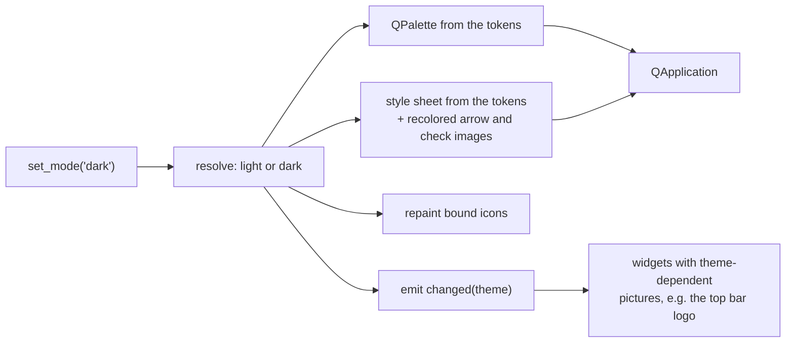

# Theme

The look of the application follows the Rumia brand guidelines (v2). Everything
visual — colors, fonts, sizes, icons — is defined once, in
`src/rumia_configurator/gui/theme/`, and widgets only say *what* they are
(a primary button, a card, an error callout), never *how* they look.

```
theme/tokens.py     colors of the two themes, typography, metrics, contrast pairs
theme/contrast.py   WCAG contrast ratio
theme/qss.py        builds the Qt style sheet from the tokens
theme/fonts.py      loads the bundled fonts
theme/icons.py      Lucide icons recolored with the tokens
theme/manager.py    ThemeManager: applies light or dark, switches at run time
theme/fonts/        Archivo, IBM Plex Sans, IBM Plex Mono (+ their OFL licenses)
theme/icons/        Lucide SVG files (+ ISC license)
widgets/brand.py    brand components built on the style sheet
```

Source files, from the repository root:

- `src/rumia_configurator/gui/theme/tokens.py`
- `src/rumia_configurator/gui/theme/contrast.py`
- `src/rumia_configurator/gui/theme/qss.py`
- `src/rumia_configurator/gui/theme/fonts.py`
- `src/rumia_configurator/gui/theme/icons.py`
- `src/rumia_configurator/gui/theme/manager.py`
- `src/rumia_configurator/gui/widgets/brand.py`
- `src/rumia_configurator/gui/theme_demo.py`

## Design tokens: `theme/tokens.py`

This module is plain Python, without Qt, so the contrast rules can be tested
without a display.

### Colors

Each theme is a `Palette` with the same roles. The two instances are `LIGHT`
and `DARK`; `THEMES` maps `ThemeName.LIGHT` / `ThemeName.DARK` to a complete
`Theme` (palette, plot series, typography, metrics).

| Role | Light | Dark | Used for |
| --- | --- | --- | --- |
| `bg` | `#FFFFFF` | `#0B2326` | window, cards |
| `surface` | `#F4F8F8` | `#12333A` | panels, alternate rows, tiles, callouts |
| `line` | `#DDE6E6` | `#2A5156` | borders, separators, grids |
| `ink` | `#0B2326` | `#FFFFFF` | titles and values |
| `text` | `#3E5357` | `#B7C7C9` | body and secondary text |
| `primary` | `#048087` | `#048087` | fill of primary buttons |
| `on_primary` | `#FFFFFF` | `#FFFFFF` | text on primary buttons |
| `link` | `#048087` | `#68B3B3` | links, active tab, selection, focus, LED Operational |
| `on_link` | `#FFFFFF` | `#0B2326` | text on a `link` fill (selected rows) |
| `link_on_surface` | `#0B2326` | `#68B3B3` | links inside `surface` containers |
| `accent` | `#E7A92F` | `#E7A92F` | LED Pre-op, warning badges; never text |
| `on_accent` | `#0B2326` | `#0B2326` | text on an accent badge |
| `error` | `#B3261E` | `#FF8A80` | errors, SDO aborts, EMCY, bus-off |
| `error_bg` | `#FCEEED` | `#4A2B2E` | EMCY rows in the bus monitor |
| `badge` / `on_badge` | `#0B2326` / white | `#2A5156` / white | neutral badges (RUMIA) |
| `statusbar` / `on_statusbar` | `#0B2326` / white | `#061719` / white | status bar |
| `statusbar_muted` | `#68B3B3` | `#68B3B3` | secondary text in the status bar |
| `statusbar_error` | `#FF8A80` | `#FF8A80` | error LED and error text in the status bar: it is always dark, and `error` of the light theme is below 3:1 on it |
| `tooltip` / `on_tooltip` | `#0B2326` / white | `#12333A` / white | tooltips |

The dark `error_bg` is provisional.

### Color rules and why

- **No color outside the tokens** (UI-COL-01). A test fails if a hex color
  appears in any file under `gui/` other than `tokens.py`, or if the generated
  style sheet uses a color that is not a token.
- **Text contrast at least 4.5:1, graphics at least 3:1** (WCAG 2.1 AA,
  UI-COL-02).
- **Teal text only on white.** Teal on `surface` is 4.42:1, just below 4.5, so
  links in panels use `link_on_surface` (ink, underlined) in the light theme.
- **Dark theme: links and selection in Sky Blue**, because teal on Deep Ink is
  only 3.46:1. Teal stays as the fill of primary buttons (white on teal is
  4.73:1).
- **The yellow never carries text** and is not used for plot lines. The Pre-op
  LED is yellow without a border even though it is below 3:1 on white: the
  state is always written next to it (UI-COL-04).
- **No grey lighter than `text` for text**, placeholders included.

### Contrast pairs

`TEXT_PAIRS` lists every text/background combination the style sheet produces;
`GRAPHIC_PAIRS` lists LEDs, focus rings and icons. Each `ContrastPair` names a
foreground role, a background role, the minimum ratio and what it is used for:

```python
ContrastPair("link_on_surface", "surface", TEXT_MIN, "links in panels")
```

`tests/test_theme_tokens.py` checks every pair in both themes. A graphic pair
may carry a `waiver`, a written reason for accepting it below the minimum; the
only one today is the Pre-op LED. A test also fails if a waiver is no longer
needed, so exceptions do not pile up by habit.

### Plot series

`SERIES` gives the style of the first three lines of a plot: teal solid, slate
dashed, ink solid (Sky Blue, light grey dashed and white in the dark theme).
They will be used by the plots.

### Typography and metrics

`Typography` holds the font families and sizes in pixels:

| Token | Value | Used for |
| --- | --- | --- |
| `title_family` | Archivo SemiExpanded | titles (`title`, `h2`) |
| `sans_family` | IBM Plex Sans | body text, buttons, menus |
| `mono_family` | IBM Plex Mono | values, IDs, hexadecimal, frames |
| `page_title_px` / `section_title_px` | 20 / 16 | page and section titles |
| `body_px` / `small_px` | 13 / 12 | text, secondary text |
| `mono_px` | 13 | mono values |
| `label_px`, `label_spacing_em` | 11, 0.08 em | uppercase section labels |
| `badge_px` | 10 | badges |
| `value_px` / `unit_px` | 26 / 14 | large live values and their unit |

`Metrics` holds radii (buttons 6, cards 10, tiles 8, badges 3), heights
(buttons 40 / 36 / 32 / 28, inputs 32, status bar 28), the spacing scale
(`space_xs` 4 … `space_xxl` 24) and the sizes of LEDs, icons and indicators.
Use these names in layouts instead of numbers.

## The style sheet: `theme/qss.py`

Qt widgets can be styled with a CSS-like language called QSS.
`build_stylesheet(theme, images)` returns the whole style sheet as a string,
filling it with the values of one theme. It is applied to the whole
application, so every widget picks up its style automatically.

Widgets choose their look with **dynamic properties**, set with
`widget.setProperty(name, value)` and matched in QSS with
`Widget[name="value"]`:

| Widget | Property | Values |
| --- | --- | --- |
| `QPushButton` | `variant` | `primary`, `secondary` (default), `link` |
| `QPushButton` | `buttonSize` | `large` (40), `bar` (32), `compact` (28); none = 36 |
| `QPushButton` (link) | `onSurface` | `"true"` inside surface containers |
| `QFrame` | `role` | `card`, `panel`, `tile`, `tile-outline`, `callout`, `statusbar`, `separator` |
| `QFrame` (callout) | `kind` | `info`, `warning`, `error` |
| `QLabel` | `role` | `title`, `h2`, `strong`, `mono`, `small`, `value`, `unit`, `section`, `callout-title`, `error`, `badge`, `led`, `card-icon` |
| `QLabel` (badge) | `kind` | `warning` |
| `QLabel` (LED) | `state` | `operational`, `preop`, `stopped`, `absent`, `error` (adapter lost, bus-off) |
| `QLabel` (status bar) | `muted` | `"true"` for secondary text |

Example, a compact primary button and a card:

```python
button = QPushButton("Save")
button.setProperty("variant", "primary")
button.setProperty("buttonSize", "compact")

card = QFrame()
card.setProperty("role", "card")
```

In practice you rarely set these by hand: the helpers in
[Brand components](#brand-components) do it.

Things to know about Qt style sheets:

- The size property is called `buttonSize`, not `size`: `size` is already a
  Qt property of every widget and `setProperty("size", ...)` is silently
  ignored.
- If you change a dynamic property **after** the widget is shown, Qt does not
  restyle it by itself: call `refresh_style(widget)` from `widgets/brand.py`.
- QSS has no `letter-spacing` or `text-transform`: section labels get their
  font in code (`SectionLabel`).
- QSS cannot recolor an SVG. For the arrows of combo boxes and spin boxes and
  for the check mark, `ThemeManager` writes recolored copies of the icons to a
  temporary folder and passes their paths in `images` (see `STYLE_IMAGES`).
- A syntax error makes Qt ignore the **whole** style sheet and print "Could not
  parse application stylesheet". A test catches this; after editing `qss.py`
  run `uv run pytest tests/test_theme_qt.py`.

## Applying the theme: `theme/manager.py`

`install_theme(app, mode)` is called once, right after creating the
`QApplication`. It:

1. sets the **Fusion** style, so the interface looks the same on Windows, Linux
   and macOS and fully follows the palette;
2. loads the bundled fonts and makes IBM Plex Sans 13 px the default font;
3. sets the window icon;
4. creates the `ThemeManager` and returns it, with the font loading result.

`ThemeManager` owns the current theme:

| Member | What it does |
| --- | --- |
| `set_mode(mode)` | `"system"`, `"light"` or `"dark"`; applies it immediately |
| `mode`, `theme` | the user's choice and the resolved `Theme` |
| `color(role)` | hex value of a palette role in the current theme |
| `bind_icon(widget, name, role, size)` | gives a button or label an icon that is repainted when the theme changes |
| `changed` | Qt signal emitted with the new `Theme` after every switch |

`"system"` follows the operating system's color scheme
(`QStyleHints.colorScheme()`) and reacts when the user changes it while the
application runs.



Most widgets need nothing: the new style sheet restyles them. Only a widget
that draws a theme-dependent picture or sets colors in code must react to
`changed`. Examples: the top bar swaps the logo, and the theme demo recolors
table items.

`theme_manager()` returns the manager created by `install_theme()` from
anywhere in the GUI code; the brand helpers use it to bind icons.

## Fonts: `theme/fonts.py`

The fonts are part of the package (`theme/fonts/<family>/`, SIL Open Font
License, with each `OFL.txt`) and are registered with Qt at start-up, without
installing them on the system (UI-TYP-01):

| Family | Files | Source |
| --- | --- | --- |
| Archivo SemiExpanded | Bold, SemiBold | Omnibus-Type/Archivo, static 112.5% width instances |
| IBM Plex Sans | Regular, Medium, SemiBold | IBM/plex |
| IBM Plex Mono | Regular, Medium | IBM/plex |

The brand asks for Archivo at 112% width. A static *SemiExpanded* instance is
used instead of the variable font because variable width axes are not reliable
in Qt on every platform.

`load_fonts()` returns a `FontLoadResult` (`families`, `failures`,
`missing_families`). A font that cannot be loaded is logged; Qt then falls back
to a system font. `sans_font()`, `mono_font()` and `section_label_font()`
return ready `QFont` objects for code that sets fonts directly. Use the mono
font for every number that changes, so digits do not jump (UI-TYP-02).

## Icons: `theme/icons.py`

Icons are [Lucide](https://lucide.dev) stroke icons (ISC license) stored as SVG
in `theme/icons/`. Lucide SVGs draw with `currentColor`; `icon_pixmap(name,
color, size, ratio)` replaces it with a token color and renders the SVG, and
`icon(name, color)` builds a `QIcon` sharp on normal and high-density screens.
Rendered pixmaps are cached.

Usually you do not call them directly: pass `icon="refresh-cw"` to
`make_button()`, or use `theme_manager().bind_icon(...)`, so the icon follows
the theme. `available_icons()` lists the bundled names. To add one, follow
[Recipes](recipes.md#add-an-icon).

## Brand components

`gui/widgets/brand.py` builds the components of the mockup on top of the
style sheet roles. Callers pass texts that are already translated.

| Component | What it is |
| --- | --- |
| `make_button(text, variant, size, icon)` | push button; `variant` `"primary"` or `"secondary"`, `size` `"large"`, `"normal"`, `"bar"`, `"compact"` (UI-CMP-01) |
| `style_button(button, variant, size, icon)` | gives a `QPushButton` subclass the look of `make_button()` |
| `ElidedButton(min_text_width, max_text_width)` | button whose text is elided in the middle only when the layout gives it less room; `set_full_text(text, tooltip)`; when elided, the tooltip shows the whole text. Used for the adapter name in the top bar |
| `make_link(text, on_surface)` | button that looks like a link; ink and underlined on surface |
| `make_label(text, role)` | label with a style sheet role |
| `SectionLabel(text)` | uppercase mono label above a group of fields; `setText()` keeps it uppercase |
| `Badge(text, warning)` | small mono tag, e.g. RUMIA |
| `Card(title, icon)` | white card with radius 10 and an icon in a surface circle (UI-CMP-02); add content to `card.body`; `set_title()` |
| `Callout(title, text, kind)` | hint, warning or error with a colored bar on the left (UI-CMP-03) |
| `StatusLed(state, text)` | colored dot **plus** text: state is never shown by color alone (UI-COL-04); `set_state()` |
| `ValueTile(caption, value, unit)` | live value in large mono digits; `set_value()` |
| `refresh_style(widget)` | re-applies the style sheet after a property change |

```python
from rumia_configurator.gui.widgets.brand import Callout, Card, make_button

card = Card(self.tr("Settings"), icon="cpu")
card.body.addWidget(Callout(self.tr("1 unsaved change"), self.tr("Press Save to keep it.")))
card.body.addWidget(make_button(self.tr("Save to sensor"), "primary", "large"))
```

## Theme demo

`rumia-configurator --theme-demo` opens `gui/theme_demo.py`: a gallery with
every component, typography, callouts, inputs, LEDs, a table with a modified
row and an EMCY row, and a status bar. The *System / Light / Dark* buttons at
the top switch theme live, and the choice is saved like in the application.
Use it to check any visual change in both themes; it is a developer tool and
is not translated.

## Window icon and logos

`gui/assets/app_icon.png` (window icon) and `gui/assets/logo_light.png` /
`logo_dark.png` (top bar) are generated files. The executables' icons are in
`packaging/icons/`. All of them come from `packaging/make_icons.py`; see
[Recipes](recipes.md#regenerate-icons-and-logos).
